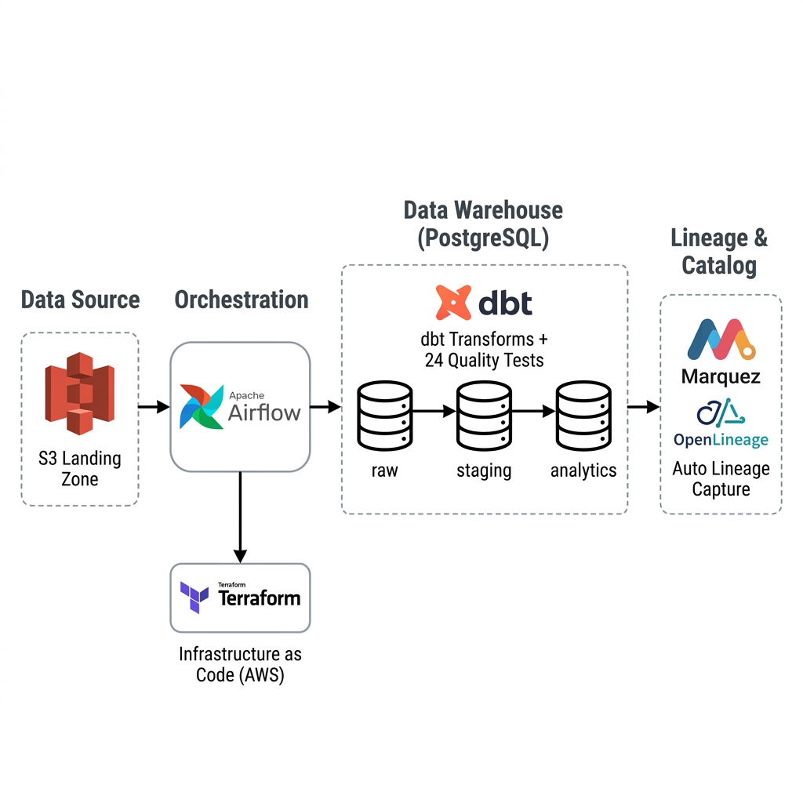

# E-Commerce Data Quality & Lineage Platform

> ⭐ If this project helped you, consider giving it a star!

I built this project to solve a problem every data team runs into — bad data makes it into your dashboards and nobody knows where it came from or how to fix it.

This pipeline handles the full journey of e-commerce data: from raw orders landing in S3, through transformation and quality checks with dbt, all the way to a data catalog in Marquez that automatically tracks where every piece of data came from.

---

## Architecture



Data flows left to right:
- **AWS S3** is the landing zone where raw data arrives daily
- **Apache Airflow** runs the pipeline on a schedule and coordinates all the steps
- **PostgreSQL** is the data warehouse, split into three layers: raw → staging → analytics
- **dbt** handles all the SQL transformations and runs 24 data quality tests on every run
- **OpenLineage + Marquez** automatically captures the full lineage of every table — no manual documentation needed
- **Terraform** provisions the S3 infrastructure on AWS

---

## What It Does

The Airflow DAG runs four tasks, one after another:

**1. Load raw data** — Orders, users, products, and order items land in the PostgreSQL `raw` schema. In a real setup this would pull from S3; here it simulates that exact flow.

**2. Stage the data** — dbt creates four staging views that clean up the raw tables: fix column names, standardize types, rename fields to match our conventions.

**3. Build analytics tables** — Three final tables get built from the staging layer:
- `dim_users` — one row per user
- `dim_products` — one row per product
- `fct_orders` — one row per order, with total revenue and item counts calculated

**4. Run data quality tests** — 24 automated tests run against every model before anything is considered done.

---

## Data Quality Tests

Every pipeline run validates the data before it reaches analysts:

| Test | What it catches |
|------|----------------|
| `unique` | Duplicate order IDs, user IDs |
| `not_null` | Missing required fields |
| `relationships` | Orders pointing to users that don't exist |
| `accepted_values` | Invalid order statuses (e.g. typos like "deliverd") |
| `is_valid_email` | Malformed email addresses in the users table |

If any test fails, the pipeline stops — bad data never reaches the analytics layer.

---

## Data Lineage with Marquez

After every run, Marquez has a complete picture of where each table came from. Open `http://localhost:3000`, switch to the `postgres://postgres:5432` namespace, and click on `fct_orders` — you'll see the full graph tracing back through every transformation to the raw source tables.

This is what makes debugging fast. If someone says "the revenue numbers look wrong," you don't have to read through SQL files to figure out which raw table caused it. You just look at the lineage graph.

---

## Tech Stack

| Tool | Version | Why |
|------|---------|-----|
| Apache Airflow | 2.10.4 | Scheduling and orchestration |
| PostgreSQL | 15 | Data warehouse |
| dbt | 1.8.0 | SQL transformations and quality tests |
| OpenLineage | 1.25.0 | Lineage event emission |
| Marquez | 0.43.0 | Lineage UI and catalog |
| Terraform | 1.5.7 | AWS infrastructure |
| Docker | — | Runs everything locally |

---

## Project Structure

```
├── dags/
│   └── ecommerce_pipeline_dag.py    # The Airflow pipeline
├── dbt_ecommerce/
│   ├── models/
│   │   ├── staging/                 # 4 staging views
│   │   └── marts/                   # dim_users, dim_products, fct_orders
│   ├── tests/generic/               # Custom email validation test
│   └── profiles.yml
├── terraform/
│   ├── main.tf
│   ├── aws_resources.tf             # S3 bucket
│   └── variables.tf
├── postgres-init/
│   └── init.sql                     # Creates databases and schemas on startup
├── docs/
│   └── architecture.png
├── Dockerfile.airflow               # Airflow image with dbt and OpenLineage pre-installed
└── docker-compose.yml
```

---

## Running It Locally

You need Docker and Docker Compose. That's it.

```bash
git clone https://github.com/azzammasood/ecommerce-data-quality-lineage-platform.git
cd ecommerce-data-quality-lineage-platform

# Start everything
docker compose up -d
```

Wait about 90 seconds for all services to start, then open:

- **Airflow** → http://localhost:8080 (username: `admin`, password: `admin`)
- **Marquez** → http://localhost:3000

### Trigger the pipeline

In the Airflow UI, find the `ecommerce_data_quality_and_lineage` DAG, turn it on, and click the play button. All four tasks should go green within a couple of minutes.

Or from the terminal:
```bash
docker exec $(docker ps -qf name=airflow-scheduler) \
  airflow dags trigger ecommerce_data_quality_and_lineage
```

### See the lineage

1. Open Marquez at http://localhost:3000
2. Click the namespace dropdown (top right) and select `postgres://postgres:5432`
3. Click on any dataset — try `ecommerce.analytics.fct_orders`
4. Explore the lineage graph, schema, and I/O tabs

---

## AWS Setup (Terraform)

The S3 bucket that acts as the data landing zone is provisioned with Terraform:

```bash
cd terraform
terraform init
terraform plan
terraform apply
```

You'll need AWS credentials configured locally. Everything used here stays within AWS Free Tier.

---

## A Few Decisions Worth Explaining

**Why `DROP TABLE CASCADE` before reloading?** — dbt creates views on top of the raw tables. If you try to replace a raw table while a view depends on it, PostgreSQL throws an error. The CASCADE drop removes the views first, then dbt re-creates them cleanly.

**Why a custom Docker image instead of pip installs at startup?** — The original approach tried to install dbt and OpenLineage every time Airflow started, which caused dependency conflicts and timeouts. Baking everything into `Dockerfile.airflow` means the image is slow to build once, but starts instantly every time after that.

**Why dbt-ol instead of native dbt?** — `dbt-ol` is the OpenLineage wrapper for dbt. It runs `dbt` underneath but emits lineage events to Marquez at the end of every run. No changes needed in the dbt models themselves.
